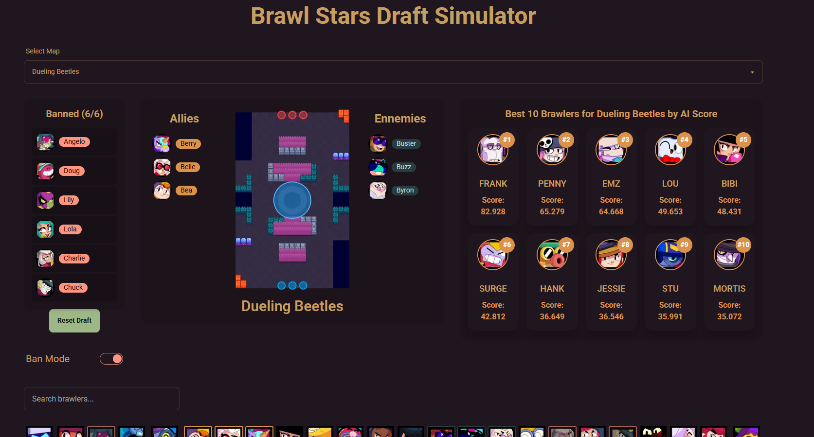

# Meta Pick AI

## Description
Meta Pick AI is a web-based tool designed to help players improve their ranked gameplay by optimizing their draft picks. With a **Flask backend** powered by a **Neural Network trained on millions of games (using PyTorch)**, the system predicts the **top 10 best brawlers** to pick for a given map, considering ally picks, enemy picks, and bans. The frontend is built using **React, TailwindCSS, and DaisyUI** to ensure a smooth and user-friendly experience.

## Features
- 🏆 **AI-powered draft recommendations**: Get optimal brawler picks based on real game data.  
- 🗺️ **Map-based suggestions**: Tailored recommendations depending on the selected map.  
- 🔍 **Real-time predictions**: Flask API processes inputs and returns the best picks instantly.  
- 🎨 **Modern UI**: Built with React, TailwindCSS, and DaisyUI for a sleek and responsive design.  

## Tech Stack
- **Backend**: Gunicorn + Flask (Python), PyTorch (Neural Network for predictions)  
- **Frontend**: React, TailwindCSS, DaisyUI  
- **Database**: PostgreSQL  
- **Deployment**: Front-end with Vercel, Back-end with Render.


**✅ Currently live at : https://metapick-ai.vercel.app ✅**

## Installation & Setup

### 1. Install backend dependencies:
```bash
pip install -r backend/requirements.txt
```

### 2. Run the Flask backend:
```bash
python backend/app.py
```

### 3. Install frontend dependencies:
```bash
cd frontend
npm install
npm run dev
```

### 4. Open the website in your browser.

## API Endpoints
- `POST /simulate_draft` – Returns top brawler recommendations based on input.  
- `GET /get_maps` – Fetches available maps.  
- `GET /get_brawlers` – Fetches brawler data.  

## Contributing
Contributions are welcome! Feel free to submit issues or open pull requests.

## License
This project is licensed under the [MIT License](LICENSE).
